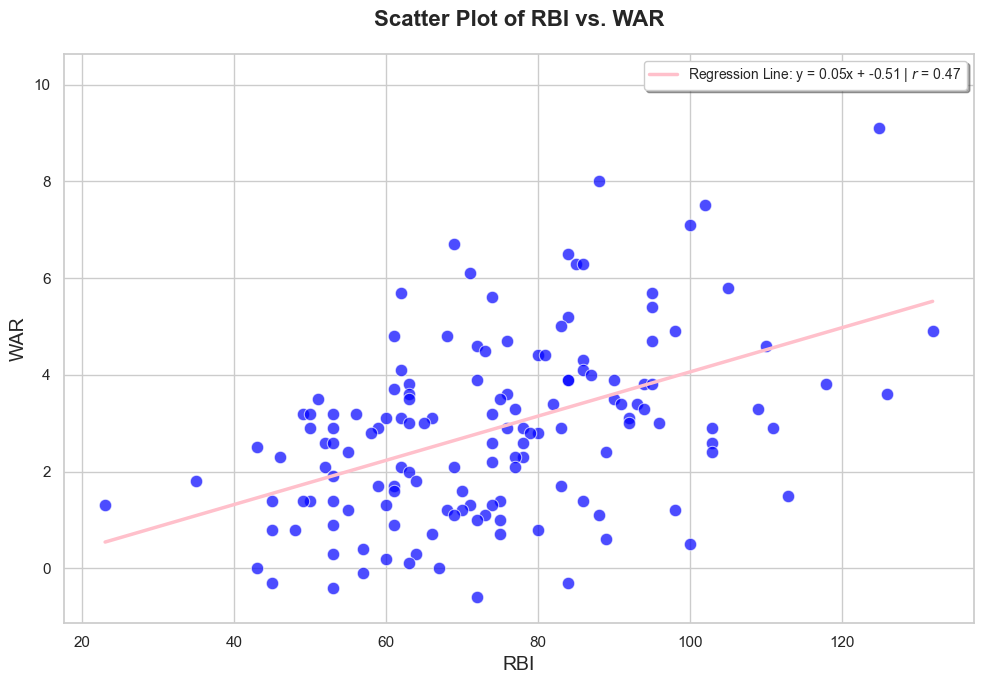
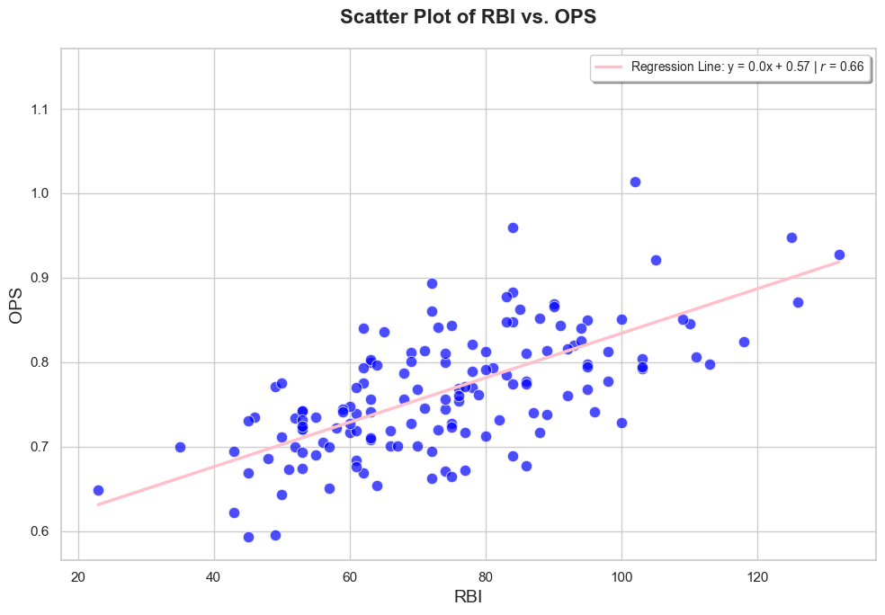
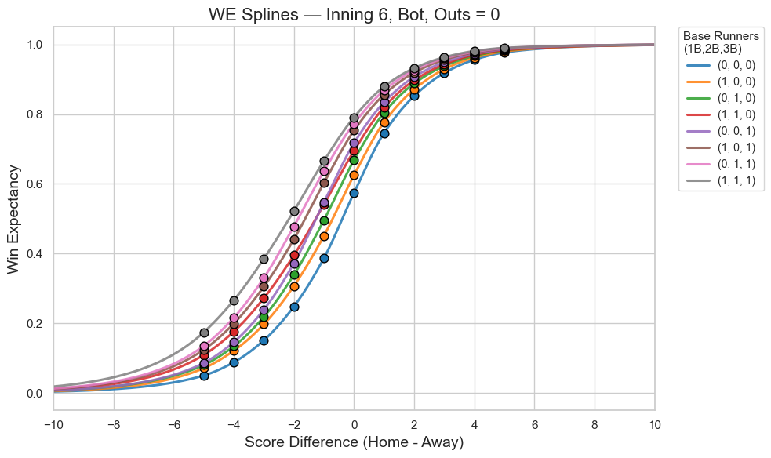
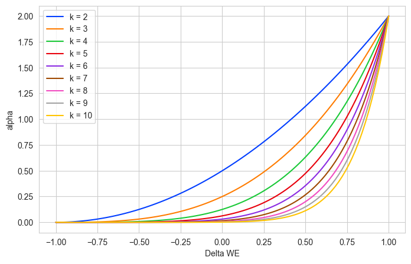
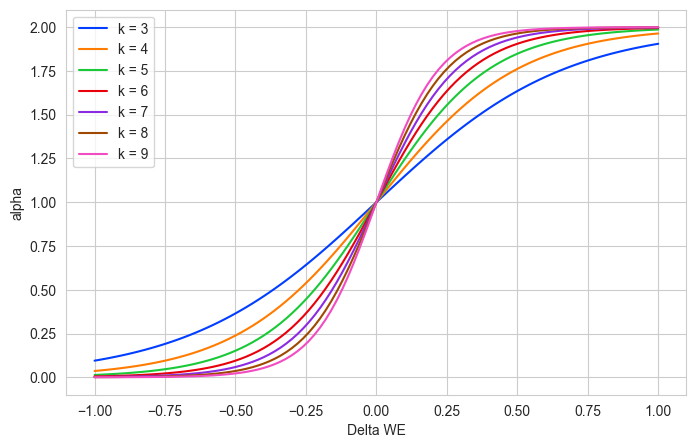
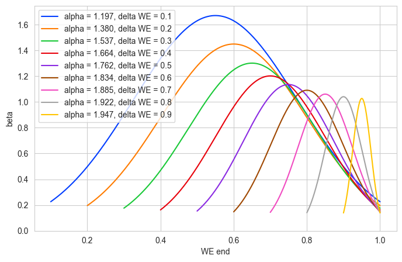
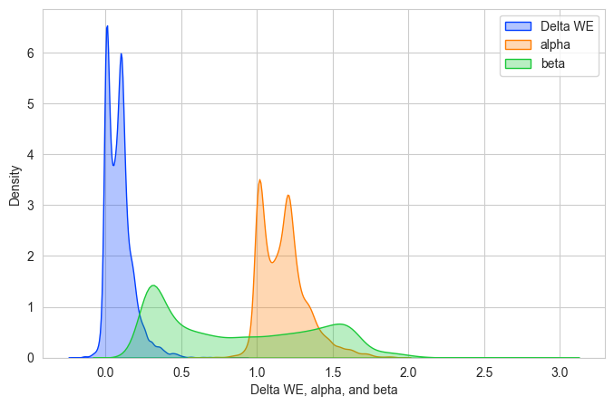
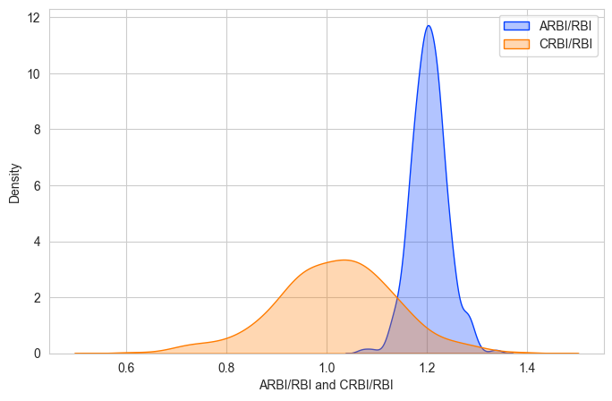

# Adjusted RBI

## Introduction

Runs Batted In (RBI) is one of baseball's most familiar measures of run production. It records how many runs a hitter drives in, but it assigns the same value to every RBI regardless of the score, inning, outs, runners on base, or influence on the team's chance of winning.

This project introduces two context-aware extensions of RBI:

- **Adjusted RBI (ARBI)** weights each RBI by the change in Win Expectancy created by the scoring event.
- **Contextual RBI (CRBI)** further distinguishes events with the same Win Expectancy change by considering the team's Win Expectancy after the event.

The objective is not to replace traditional RBI. ARBI and CRBI provide additional information about when runs were produced and how much those runs changed the competitive state of the game.

## Background

Traditional RBI depends partly on opportunity. Batters in productive lineups or favorable batting-order positions generally receive more chances to hit with runners on base. RBI also ignores leverage: a run in a close late-inning game counts the same as a run scored with a large lead.

RBI still has a meaningful positive relationship with broader offensive metrics such as OPS and WAR, as shown for qualified hitters in the 2025 MLB season.





Existing context-aware statistics such as RE24 measure changes in expected runs from base-out states, while context-neutral RBI attempts to reduce opportunity bias. ARBI and CRBI instead connect a scoring event directly to Win Expectancy, which measures the probability of winning from a specific game state.

## Data

The analysis uses pitch-level Statcast data for the 2025 MLB regular season, collected with `pybaseball`. The Tokyo opening games are included separately where necessary. Pitch records are converted into plate-appearance events, and the main analysis retains events in which the batting team's score increases.

Each retained event contains:

- game, inning, and half-inning identifiers
- outs before and after the event
- first-, second-, and third-base occupancy before and after the event
- batter and pitcher identifiers and names
- home, away, and batting-team scores before and after the event
- score differential before and after the event
- the number of runs produced during the event

The research definition of RBI differs slightly from the official scoring definition. A batter is associated with any run that scores during the plate appearance, including uncommon events that official RBI rules may exclude. The paper reports a mean official RBI total of 74.37 and a mean research total of 76.19 among the compared 2025 hitters.

Generated files are not included in the repository:

- `PA_level_data.parquet` contains the prepared scoring-event data.
- `data_with_result.parquet` contains event-level RBI, ARBI, CRBI, Win Expectancy, and adjustment components.

Both files can be regenerated by running the notebooks in the order described below.

## Method

### Win Expectancy

Win Expectancy (WE) is the probability that a team wins from a particular score, inning, out, and base-runner state. This project uses the empirical Win Expectancy table in `win_exp_table.txt`, covering score differences from -5 to +5.

For score differences outside the empirical grid, the project uses a monotone Piecewise Cubic Hermite Interpolating Polynomial within the observed range and exponential tails outside it. The extension preserves the observed table values while approaching zero for very large deficits and one for very large leads.



For each scoring event, WE is computed immediately before and after the plate appearance from the batting team's perspective:

```text
delta_WE = WE_end - WE_start
```

### Adjusted RBI

ARBI rescales the RBI from each event using an adjustment factor `alpha`:

```text
ARBI = alpha * RBI
```

The factor is a monotonically increasing function of `delta_WE` with a range from zero to two. The notebooks use the sigmoid specification with steepness `k = 4`:

```text
alpha = 2 / (1 + exp(-4 * delta_WE))
```

An event that causes a larger increase in Win Expectancy therefore receives more ARBI. The framework can also use other monotone functions, including a power function.





### Contextual RBI

Two events can produce the same change in WE but end in very different positions. Increasing WE from 0.45 to 0.65 changes the team from an underdog to a favorite, while increasing WE from 0.05 to 0.25 still leaves the team unlikely to win.

CRBI adds a second multiplier, `beta`, based on both `delta_WE` and terminal Win Expectancy:

```text
CRBI = beta * ARBI
```

For a fixed WE change, `beta` follows a bell-shaped curve centered on the middle of the feasible terminal-WE interval. This gives more weight to scoring events that move the game through its most competitive region.



## Results

The 2025 analysis contains 16,182 scoring events from the first nine innings. The mean change in Win Expectancy is 0.093 with a standard deviation of 0.091. Under the selected functions, mean `alpha` is 1.177 and mean `beta` is 0.878.



Among hitters with at least 30 research-defined RBI, the reported quartiles are:

| Percentile | ARBI/RBI | CRBI/RBI |
| --- | ---: | ---: |
| 25% | 1.18 | 0.94 |
| 50% | 1.20 | 1.02 |
| 75% | 1.22 | 1.09 |

ARBI/RBI measures how strongly a hitter's scoring events changed Win Expectancy. CRBI/RBI adds information about where those events left the team in the win-probability range. These ratios allow hitters with similar RBI totals to be differentiated by game context.



### Limitations

ARBI and CRBI depend on the selected Win Expectancy table and adjustment functions. The sigmoid steepness and contextual bell curve are modeling choices rather than uniquely correct values. The analysis uses a single MLB season, excludes extra innings from the main calculation, and applies a research definition of RBI that differs slightly from official scoring. These metrics should be interpreted alongside opportunity, rate, and overall offensive statistics rather than as standalone player rankings.

## Repository Information

### Structure

```text
adjusted_rbi/
├── README.md
├── requirements.txt
├── adjusted_rbi.py
├── collect_data.ipynb
├── get_win_exp.ipynb
├── data_visualization.ipynb
├── win_exp_table.txt
└── plots/
    ├── adjusted_rbi_distribution.png
    ├── context_adjustment.png
    ├── metric_components_distribution.png
    ├── power_adjustment.png
    ├── rbi_ops.png
    ├── rbi_war.png
    ├── sigmoid_adjustment.png
    └── win_expectancy_extension.png
```

### File descriptions

- `adjusted_rbi.py` provides reusable functions for reading the WE table, building extended WE curves, evaluating game states, and calculating ARBI and CRBI.
- `collect_data.ipynb` downloads 2025 Statcast data, converts pitch records to scoring-event records, adds pre- and post-event game state, and writes `PA_level_data.parquet`.
- `get_win_exp.ipynb` builds the WE curves, calculates event-level WE changes, applies the ARBI and CRBI functions, and writes `data_with_result.parquet`.
- `data_visualization.ipynb` aggregates results by hitter, compares RBI with established statistics, examines the adjustment functions, and creates the result figures.
- `win_exp_table.txt` is the empirical WE reference table required by the model.
- `plots/` contains selected figures from the research report.

The visualization notebook preserves the original research workflow and contains a reference to a personal helper module named `plot`. Cells using that helper must be replaced with equivalent Matplotlib or Seaborn code before the notebook is fully portable. The reusable calculations in `adjusted_rbi.py` do not depend on that module.

### Installation

Python 3.10 or newer is recommended.

```bash
python -m venv .venv
source .venv/bin/activate
python -m pip install -r requirements.txt
```

Start Jupyter from the repository root:

```bash
jupyter lab
```

### Running the analysis

Run the notebooks in this order:

1. `collect_data.ipynb` downloads and prepares the scoring-event data.
2. `get_win_exp.ipynb` calculates Win Expectancy, ARBI, and CRBI.
3. `data_visualization.ipynb` creates player summaries and figures.

Statcast collection may take time and requires internet access. Generated Parquet files remain local and are excluded from Git.

### Using the core functions

```python
from adjusted_rbi import adjusted_rbi, contextual_rbi

rbi = 1
delta_we = 0.20
we_end = 0.65

arbi = adjusted_rbi(rbi, delta_we)
crbi = contextual_rbi(rbi, delta_we, we_end)

print(arbi, crbi)
```
